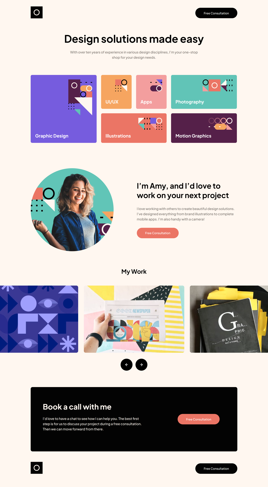

# Frontend Mentor - Single-page design portfolio solution

This is a solution to the [Single-page design portfolio challenge on Frontend Mentor](https://www.frontendmentor.io/challenges/singlepage-design-portfolio-2MMhyhfKVo). Frontend Mentor challenges help you improve your coding skills by building realistic projects.

## Table of contents

- [Overview](#overview)
    - [The challenge](#the-challenge)
    - [Screenshot](#screenshot)
    - [Links](#links)
- [My process](#my-process)
    - [Built with](#built-with)
    - [What I learned](#what-i-learned)
    - [Continued development](#continued-development)
- [Author](#author)
- [Acknowledgments](#acknowledgments)

## Overview

### The challenge

Users should be able to:

- View the optimal layout for the site depending on their device's screen size
- See hover states for all interactive elements on the page
- Navigate the slider using either their mouse/trackpad or keyboard

### Screenshot

### Links

- Solution URL: [Frontend Mentor Solution Page](https://www.frontendmentor.io/solutions/single-page-designers-portofolio-including-custom-infinite-carousel-u7T4o_P9JF)
- Live Site URL: [Hosted on GitHub Pages](https://aleknovkovski.github.io/FEM-single-page-design-portfolio/working/)

## My process

### Built with

- Semantic HTML5 markup
- CSS custom properties
- Flexbox
- CSS Grid

### What I learned

I learned that I am just "incompatible with" ready-made libraries for front-end purposes. I think it's because when you're building a fully custom front-end, you want full control of components. I spent some time trying to find a carousel library that fits the project, only to be frustrated with how much tweaking it takes to adapt them. I just find it easier to create something from scratch. 

So I learned how to build an "infinite" carousel. It's where if an item drops off the left side, it appears on the right side. To do so I had to apply some algorithmic thinking.

Additionally, if both edges are visible, I wanted the same item to exist on both sides, so it literally seems like its portal-ing from one side to the other.  The solution involved creating a duplicate of just the right item at the right time. 

It turned out this particular effect wasn't even needed for this particular website design, as the number of visible items is always smaller than the number of total slides, so you won't ever have the slide on the left or right edges visibile. But I kept my solution, just because I love the effect, and let it display on larger screens, where you can see this "portal-ing" effect. 

### Continued development

I might try to create even more complex carousels or sliders in the future, just as a learning experience.

## Author

- Frontend Mentor - [@aleknovkovski](https://www.frontendmentor.io/profile/aleknovkovski)
- Linkedin - [@aleknovkovski](https://www.linkedin.com/in/aleknovkovski/)

